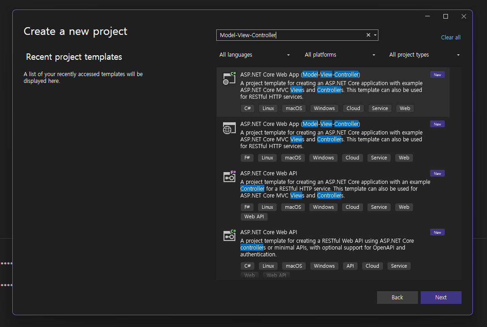

# ASP.NET Core MVC 시작
- 자습서 링크: [ASP.NET Core MVC 시작](https://learn.microsoft.com/ko-kr/aspnet/core/tutorials/first-mvc-app/start-mvc?view=aspnetcore-9.0&tabs=visual-studio)

## 시작하기

### 프로젝트 생성 사전 체크 사항

- 프로젝트 초기화 템플릿 이름: ASP.NET Core Web App (Model-View-Controller)
- Visual Studio Installer 를 통해 `ASP.NET 및 웹 개발` 워크로드를 다운로드 받아두어야 위 템플릿을 선택할 수 있음  



- dotnet CLI 로도 생성 가능 (자습서에선 소개 X)
- 템플릿 검색 명령어: `dotnet\[.exe\] new list 'Model'`


> 위 스크린샷에서는 WSL 로 마운트한 프로젝트라 .exe 까지 붙여 실행함

### 프로젝트 생성과 실행

- 샘플코드(치트시트): [MvcMovie](https://github.com/dotnet/AspNetCore.Docs/tree/main/aspnetcore/tutorials/first-mvc-app/start-mvc/sample)
- .NET 9.0 기준으로 생성
- 앱 실행 시 랜덤 포트 할당이 Default

> Visual Studio 앱 실행 단축키
> 
> F5: 디버깅 실행
> Ctrl + F5: 디버깅 없이 실행

## MVC 컴포넌트 추가

새삼 다시보는 MVC 아키 정의

- Models: 앱의 데이터를 표현하는 클래스
- Views: 앱의 UI를 표시하는 구성 요소
- Controllers:
    - 브라우저 Requests 처리, 응답
    - 모델 데이터의 검색
    - 응답 반환 뷰 템플릿 호출

로직 범주에 따라 소속할 컴포넌트 분류를 정리하면

- Biz. 로직: Model
- UI 로직: View
- 입력 로직: Controller


### Controller 추가
<!-- 튜토리얼은 GUI 기준으로 설명하니, 여기선 단축키 위주로 적어놓자. -->

- VS IDE 컨트롤러 추가 단축키 콤보
    1. Controllers 네임스페이스 에서
    1. `Ctrl + Shift + A` (Add New Item...)
    1. `Ctrl + E` (Search) - 템플릿 다이얼로그인 경우 검색 포커스
    1. `Con` 검색, `Tab` 으로 템플릿 포커싱
    1. 이대로 생성하고 Rename 하거나
    1. `Alt + N` (클래스 이름 포커싱)
    1. `Alt + A` (Add 단추 클릭)

#### 기본 URL 라우팅 논리

- `/[Controller]/[ActionName]/[Parameters]`
- 이 형식은 `Program.cs` 에서 정의

```C#
app.MapControllerRoute(
    name: "default",
    pattern: "{controller=Home}/{action=Index}/{id?}");
```

- 쿼리 스트링의 변수 이름은 메소드의 매개 변수 이름으로 자동 매핑
- 경로 매개 변수 (위 코드 샘플에서 {id?}) 도 메소드의 매개 변수 이름으로 매핑

- `public string Welcome(string name, int numTimes = 1)`
    - `https://localhost:{PORT}/HelloWorld/Welcome?name=Rick&numtimes=4`
- `public string Welcome(string name, int ID = 1)`
    - `https://localhost:{PORT}/HelloWorld/Welcome/3?name=Rick`

### View 추가

Razor-based 뷰 템플릿은

- `.cshtml` 확장자
- C# 으로 HTML 출력

```C#
public IActionResult Index()
{
    return View();
}
```
앞선 코드는:
- 컨트롤러의 View 메소드 호출
- HTML 응답에서 뷰 템플릿을 사용

컨트롤러 메소드들은:
- action methods 로 불리움. 직전 예시 코드에서는 `Index` 가 액션 메소드
- 일반적으로 `IActionResult` 혹은 `ActionResult` 클래스를 리턴

```CSHTML
@{
    ViewData["Title"] = "Index";
}

<h2>Index</h2>

<p>Hello from our View Template!</p>
```

View 템플릿은:
- `./Views/HelloWrold/Index.cshtml` 이 사용될 것임
- `@{ ... }` 에서 ... 속에 C# 문법을 사용

#### View 와 Layout 수정

레이아웃 템플릿은:
- 사이트 HTML 컨테이너 레이아웃을 한 곳에 지정
- 사이트 여러 페이지에 레이아웃 적용
- 예제에서 경로는 `Views/Shared/_Layout.cshtml`
- `Views/_ViewStart.cshtml` 에서 지정
- `@RenderBody()`: 모든 보기 전용 페이지가 렌더딩 되는 곳

#### Controller 에서 View 로 데이터 전달

- [모델 바인딩에 대해](https://learn.microsoft.com/ko-kr/aspnet/core/mvc/models/model-binding?view=aspnetcore-9.0)
- ViewData 딕셔너리를 통해 데이터를 넘길 수 있음

```C#
// GET: /HelloWorld/Welcome/
public IActionResult Welcome(string name, int numTimes = 1)
{
    ViewData["message"] = "Hello " + name;
    ViewData["numTimes"] = numTimes;
    return View();
}
```

### Model 추가

- 모델 클래스는 [Entity Framework Core](https://learn.microsoft.com/en-us/ef/core)(EF Core) 로 데이터베이스와 상호 작용 
- EF Core 는 ORM 프레임워크
- 모델 클래스들은 POCO 로 불리움 (Plain Old CLR Object)
- 클래스 자체는 EF Core 에 의존하지 않음

#### 데이터 모델 클래스 추가하기

```C#
using System.ComponentModel.DataAnnotations;

namespace MvcMovie.Models;

public class Movie
{
    public int Id { get; set; }
    public string? Title { get; set; }
    [DataType(DataType.Date)]
    public DateTime ReleaseDate { get; set; }
    public string? Genre { get; set; }
    public decimal Price { get; set; }
}
```

- PK 는 Id
- `ReleaseDate` 타입은 `Date` 데이터의 [DataType](https://learn.microsoft.com/en-us/dotnet/api/system.componentmodel.dataannotations.datatype)
    - 시간 정보 없이 일자 정보 표현
- [DataAnnotations](https://learn.microsoft.com/en-us/dotnet/api/system.componentmodel.dataannotations) 는 다른 튜토리얼에서 소개
- `string?` 에서 `?` 는 [널러블 참조 타입](https://learn.microsoft.com/en-us/dotnet/csharp/nullable-references)

#### NuGet Packages 추가하기

Visual Studio 는 자동 설치되지만, VS Code 는 수동 설치 필요할 수 있음

```shell
dotnet tool uninstall --global dotnet-aspnet-codegenerator
dotnet tool install --global dotnet-aspnet-codegenerator
dotnet tool uninstall --global dotnet-ef
dotnet tool install --global dotnet-ef
dotnet add package Microsoft.EntityFrameworkCore.Design
dotnet add package Microsoft.EntityFrameworkCore.SQLite
dotnet add package Microsoft.VisualStudio.Web.CodeGeneration.Design
dotnet add package Microsoft.EntityFrameworkCore.SqlServer
dotnet add package Microsoft.EntityFrameworkCore.Tools
```

#### CRUD 페이지 추가하기

Visusal Studio 에서는 New Scaffolded Item 을 통해 EF Core 다이얼로그로 CRUD 페이지를 생성할 수 있고, 이에 따라 패키지가 추가됨.

#### DI

ASP.NET Core 는 DI 로 빌드된다. 데이터베이스 컨텍스트와 같은 서비스들은 `Program.cs` 에 DI 로 등록된다. 이러한 서비스들은 컴포넌트에 생성자 파라미터를 요구함으로써 제공된다.

```C#
var builder = WebApplication.CreateBuilder(args);
builder.Services.AddDbContext<MvcMovieContext>(options =>
    options.UseSqlServer(builder.Configuration.GetConnectionString("MvcMovieContext") ?? throw new InvalidOperationException("Connection string 'MvcMovieContext' not found.")));
```

`appsettings.json` 파일에 추가된 커넥션 스트링 모습

```json
{
  "Logging": {
    "LogLevel": {
      "Default": "Information",
      "Microsoft.AspNetCore": "Warning"
    }
  },
  "AllowedHosts": "*",
  "ConnectionStrings": {
    "MvcMovieContext": "Server=(localdb)\\mssqllocaldb;Database=MvcMovieContext-4ebefa10-de29-4dea-b2ad-8a8dc6bcf374;Trusted_Connection=True;MultipleActiveResultSets=true"
  }
}
```

[ASP.NET Core configuration system](https://learn.microsoft.com/en-us/aspnet/core/fundamentals/configuration/?view=aspnetcore-9.0) 가 `ConnectionString` 키를 읽는다.

#### 강타입 모델과 `@model` 디렉티브

앞선 `ViewData` 딕셔너리가 후행 바운드된 방식의 동적 오브젝트를 View 에 전달하는 것과 달리 강타입 방식으로 모델 객체를 전달할 수 있다.

뷰 파일에서 최상단 `@model` 선언은 view 가 기대할 수 있는 객체의 타입이다.

```html
@model MvcMovie.Models.Movie

@{
    ViewData["Title"] = "Details";
}

<h1>Details</h1>

<div>
    <h4>Movie</h4>
    <hr />
    <dl class="row">
        <dt class = "col-sm-2">
            @Html.DisplayNameFor(model => model.Title)
        </dt>
        <dd class = "col-sm-10">
            @Html.DisplayFor(model => model.Title)
        </dd>
        <dt class = "col-sm-2">
            @Html.DisplayNameFor(model => model.ReleaseDate)
        </dt>
        <dd class = "col-sm-10">
            @Html.DisplayFor(model => model.ReleaseDate)
        </dd>
        <dt class = "col-sm-2">
            @Html.DisplayNameFor(model => model.Genre)
        </dt>
        <dd class = "col-sm-10">
            @Html.DisplayFor(model => model.Genre)
        </dd>
        <dt class = "col-sm-2">
            @Html.DisplayNameFor(model => model.Price)
        </dt>
        <dd class = "col-sm-10">
            @Html.DisplayFor(model => model.Price)
        </dd>
    </dl>
</div>
<div>
    <a asp-action="Edit" asp-route-id="@Model.Id">Edit</a> |
    <a asp-action="Index">Back to List</a>
</div>
```

이 때 `Model` 오브젝트는 강하게 타이핑된다.

리스트 오브젝트의 경우 아래와 같이 선언할 수 있다.

```C#
// GET: Movies
public async Task<IActionResult> Index()
{
    return View(await _context.Movie.ToListAsync());
}
```

```html
@model IEnumerable<MvcMovie.Models.Movie>

@{
    ViewData["Title"] = "Index";
}

<h1>Index</h1>

<p>
    <a asp-action="Create">Create New</a>
</p>
<table class="table">
    <thead>
        <tr>
            <th>
                @Html.DisplayNameFor(model => model.Title)
            </th>
            <th>
                @Html.DisplayNameFor(model => model.ReleaseDate)
            </th>
            <th>
                @Html.DisplayNameFor(model => model.Genre)
            </th>
            <th>
                @Html.DisplayNameFor(model => model.Price)
            </th>
            <th></th>
        </tr>
    </thead>
    <tbody>
@foreach (var item in Model) {
        <tr>
            <td>
                @Html.DisplayFor(modelItem => item.Title)
            </td>
            <td>
                @Html.DisplayFor(modelItem => item.ReleaseDate)
            </td>
            <td>
                @Html.DisplayFor(modelItem => item.Genre)
            </td>
            <td>
                @Html.DisplayFor(modelItem => item.Price)
            </td>
            <td>
                <a asp-action="Edit" asp-route-id="@item.Id">Edit</a> |
                <a asp-action="Details" asp-route-id="@item.Id">Details</a> |
                <a asp-action="Delete" asp-route-id="@item.Id">Delete</a>
            </td>
        </tr>
}
    </tbody>
</table>
```
